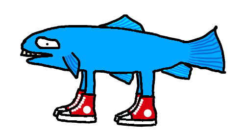

# trout

[Challenge me on Lichess!](https://lichess.org/@/TroutBot)
[Play me in the browser (locally)!](https://osrepnay.github.io/trout-web/)

A chess engine (my third attempt) in Haskell.
Two other decent Haskell engines I've found are [turncoat](https://github.com/albertprz/turncoat) and [Barbarossa](https://github.com/nionita/Barbarossa), check them out!

I think this is the strongest Haskell chess engine?
It can beat both Barbarossa and turncoat on STC and LTC.

The end goal for this engines is for it to be "superhuman", but that's still a ways away.
It can beat me though.
Does that speak to my weakness or the engine's strength? Who knows? (it's my weakness)

## Features

- Magic bitboards
- Principal variation search
- Aspiration windows
- Null move pruning
- Reverse futility pruning
- Futility pruning
- Static exchange evaluation pruning
- Razoring
- Late move reductions
- Late move pruning
- Check extensions
- Quiescence search
- Transposition table move ordering
- History heuristic move ordering
- Static exchange evaluation move ordering
- Eval tuned with stochastic gradient descent, based on Texel's method
- [En passant](https://en.wikipedia.org/wiki/En_passant)

## Running

Install [Stack](https://docs.haskellstack.org/en/stable/) (like through [GHCup](https://www.haskell.org/ghcup/)) and run `stack run`.

The executable is... somewhere in the `.stack-work` directory after running or building.

Alternatively, I *think* you might be able to run the project with cabal only using stack's generated `trout.cabal`?
It should work but I don't use cabal personally so YMMV.

## Limitations

- Plays weird
